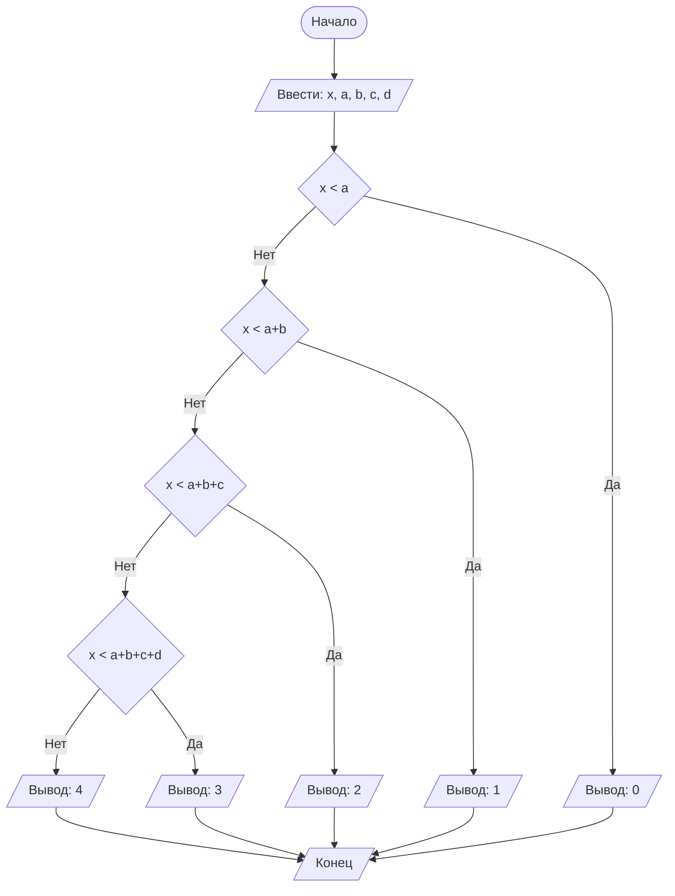

## Отчет по лабораторной работе № 1

#### № группы: `ПМ-2501`

#### Выполнил: `Хоровский Владимир Олегович`

#### Вариант: `20`

### Cодержание:

- [Постановка задачи](#1-постановка-задачи)
- [Входные и выходные данные](#2-входные-и-выходные-данные)
- [Выбор структуры данных](#3-выбор-структуры-данных)
- [Алгоритм](#4-алгоритм)
- [Программа](#5-программа)
- [Анализ правильности решения](#6-анализ-правильности-решения)

### 1. Постановка задачи
> 4 покупателя стоят в очереди за бананами. Они планируют купить A, B, C, D килограмм бананов соответственно порядку в очереди 
> (или все оставшиеся, если к моменту обслуживания покупателя в магазине остаётся меньше бананов, чем планирует купить покупатель).
> Изначально в магазине имеется X кг бананов. Сколько покупателей смогут купить бананы, которые они планируют? 
> На вход программы подаются натуральные числа X, A, B, C, D.

### 2. Входные и выходные данные

#### Входные данные

В условии нам сказано, что на вход программы подаются натуральные числа X, A, B, C, D

#### Выходные данные 

Т.к. у нас спрашивают сколько покупателей смогут купить бананы, которые они планируют?
То на выходе мы получаем целое неотрицательное число.

### 3. Выбор структуры данных

Программа получает 5 натуральных чисел на вход, поэтому выделем 5 переменных (`x`, `a`, `b`, `c`, `d`) типа `int`.

|             | название переменной | Тип (в Java) | 
|-------------|---------------------|--------------|
| X (Число 1) | `x`                 | `int`        |
| A (Число 2) | `a`                 | `int`        | 
| B (Число 3) | `b`                 | `int`        | 
| C (Число 4) | `c`                 | `int`        | 
| D (Число 5) | `d`                 | `int`        | 

Вывод данных необязательно хранить в виде переменной.

### 4. Алгоритм

#### Алгоритм выполнения программы:

1. **Ввод данных:**
   
    Программа считывает 5 целых чисел: x, a, b, c, d.

2. **Сравнение и перебор всех вариантов:**
   1. Программа сравнивает `x` и `a`. Если `x < a`, то это означает что в магазине не хватило бананов для первого покупателя <br>
   и, следовательно, 0 покупателей купили бананов столько, сколько хотели. Если `x >= a`, то программа переходит к сравнению `x` и `a+b`.

   2. Программа сравнивает `x` и `a+b`. Если `x < a+b`, то 1 покупатель купил столько, сколько хотел (покупатель с `A` килограммами бананов), <br>
   иначе `(x >= a+b)` программа переходит к сравнению `x` и `a+b+c`.

   3. Программа сравнивает `x` и `a+b+c`. Если `x < a+b+c`, то 2 покупателя купили столько, сколько хотели, <br>
   иначе `(x >= a+b+c)` программа переходит к сравнению `x` и `a+b+c+d`.

   4. Программа сравнивает `x` и `a+b+c+d`. Если `x < a+b+c+d`, то 3 покупателя купили столько, сколько хотят, <br>
   иначе `(x >= a+b+c+d)`, т.е. 4 покупателя могут купить столько, сколько хотят.
   
3. **Вывод результата**

   На экран выводится количество покупателей, которые смогут купить необходимое им количество бананов.

#### Блок-схема



### 5. Программа 

```java
import java.io.PrintStream;
import java.util.Scanner;

public class Main {
    // Объявляем объект класса Scanner для ввода данных
    public static Scanner in = new Scanner(System.in);
    // Объявляем объект класса PrintStream для вывода данных
    public static PrintStream out = System.out;

    public static void main(String[] args) {
        // Считывание 5 целых чисел (x, a, b, c, d) с консоли
        int x = in.nextInt();
        int a = in.nextInt();
        int b = in.nextInt();
        int c = in.nextInt();
        int d = in.nextInt();
        
        if (x < a)
            // Если x < a, то выводим 0
            // Иначе сравниваем x и a+b
            out.println(0);
        else{
            // Если x < a+b, то выводим 1
            // Иначе сравниваем x и a+b+c
            if (x < a+b)
                out.println(1);
            else{
                // Если x < a+b+c, то выводим 2
                // Иначе сравниваем x и a+b+c+d
                if (x < a+b+c)
                    out.println(2);
                else{
                    // Если x < a+b+c+d, то выводим 2
                    // Иначе выводим 4
                    if (x < a+b+c+d)
                        out.println(3);
                    else
                        out.println(4);
                }
            }
        }
    }
}
```
### 6. Анализ правильности решения
   Т.к. задача про количество бананов в магазине, то мы никак не выйдем за пределы int (-2<sup>31</sup>; 2<sup>31</sup> - 1)

#### Тесты:

- **Intput**:
   ```
  10 3 3 1 8
  ```
- **Output**:
   ```
  3
  ```
- **Input**:
   ```
  5 3 2 4 9
  ```
- **Output**:
   ```
  2
  ```
